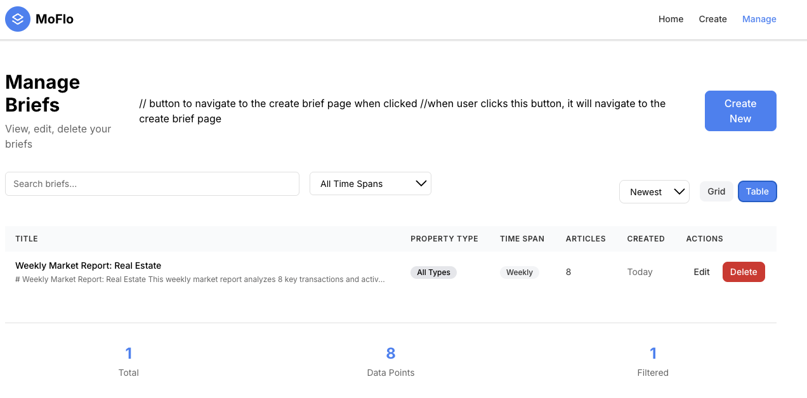

# MoEstateNews Walkthrough - Screenshot Explanations

These screenshots show how the app works. I took them in order while going through the workflow. Here's what each one shows:

## Landing Page

This is the main landing page at `/moestate-news`. This is where users land first. It's pretty straightforward just explains what the app does and gives quick access to create or manage briefs.

## Create Page

This is the create page at `/moestate-news/create`. At this point nothing is filled in yet.

Use the dropdown menu to select property type.

Next select the time span that you wnat the breif to cover. 

If you scroll down the page will automatically fill out the breif after the drop downs are filled out. 

Click the save button and the breif will automtically download. 

## Manage Page

This is the view page at `/moestate-news/view`. This is the main management interface. Grid view shows briefs as cards which is nice for browsing.

Table view is better when you have a lot of briefs and want to see them in a more compact list format.

If you want to delete an entry you must click okay.

## Edit Page

You can access this page by clicking the blue edit button on the manage page.

This is the edit page (probably `/moestate-news/create?id=something`). This is how users edit existing briefs. 

